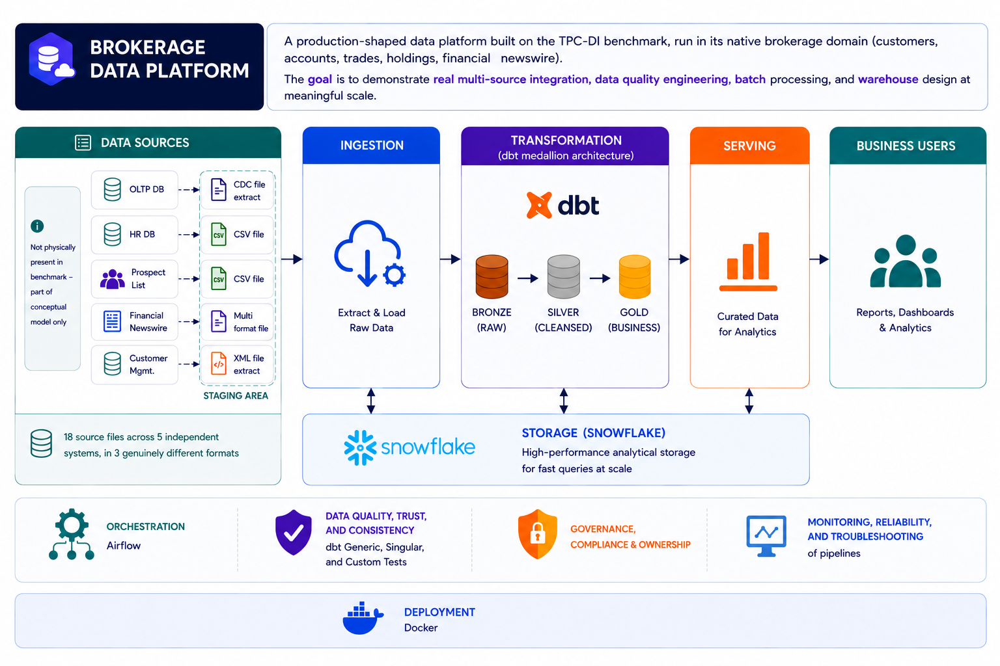

# Brokerage Data Platform

A batch data platform for a simulated brokerage, built to reproduce — and correctly resolve — the kind of multi-system integration problems that only show up with real, messy source data: schema drift between historical and incremental loads, CDC signals that don't reflect real state changes, and mixed-vocabulary systems describing the same business entity in two different ways.

>  **23 source files · 5 independent systems · 3 file formats · 5 source archetypes · 14+ documented architecture decisions · idempotent daily batch pipeline on Snowflake.**

## Table of Contents
- [Brokerage Data Platform](#brokerage-data-platform)
  - [Table of Contents](#table-of-contents)
  - [Why This Project](#why-this-project)
  - [Architecture](#architecture)
  - [Core Competencies](#core-competencies)
  - [Platform Stages](#platform-stages)
  - [Idempotent Pipeline Design (Safe Reruns)](#idempotent-pipeline-design-safe-reruns)
  - [Engineering Discipline](#engineering-discipline)
  - [Tech Stack](#tech-stack)
  - [Documentation Index](#documentation-index)

## Why This Project

Most portfolio data projects pick a clean public dataset and build a pipeline on top of it. That proves you can write dbt models and stand up Airflow — it doesn't prove you can make a call when the data itself is inconsistent, contradictory, or lying about what it represents.

This platform is built on **TPC-DI**, the industry-standard benchmark purpose-built to simulate real data integration pain: 5 independent systems (OLTP, HR, a prospect vendor, financial newswire, customer management) that know nothing about each other, delivering CSV, XML, and fixed-width files with documented, *real* data quality problems rather than injected noise. It scales to genuine "big data" volume and ships an incremental/streaming load pattern — the same batch-processing shape a production brokerage pipeline actually runs.

The point of this project isn't the star schema at the end. It's the trail of decisions that got there — each one investigated against the actual data, recorded as an ADR, and defensible to a reviewer who wasn't in the room.

## Architecture

## Core Competencies

| Area | Where it lives in this platform |
|---|---|
| **Multi-source integration** | 23 sources, 5 systems that share no common key convention, 3 file formats, unified under one bronze contract — [`02_bronze_design.md`](./docs/02_bronze_design.md), [`03_ingestion.md`](./docs/03_ingestion.md) |
| **Data quality, trust & consistency** | Built a DQ framework mapped to the 7 DAMA dimensions (validity, accuracy, completeness, consistency, uniqueness, timeliness, integrity) with a concrete, evidence-logged control at every layer — schema-drift detection and structured `_dq_errors` capture in bronze, SCD2/forward-fill/fan-trap assertions in silver, unknown-member and grain integrity checks in gold — plus a shared reconciliation macro that compares row counts across every layer boundary and logs the result to an auditable `governance.dq_audit_log`. — [`06_data_quality.md`](./docs/06_data_quality.md) |
| **Data warehousing** | Modeled a 17-table Kimball star schema in Snowflake — 10 conformed dimensions (including 2 SCD2) and 7 fact tables — governed by a hard rule that every gold column traces to a silver source, with 8 documented ADRs covering outrigger dimensions, denormalization trade-offs, derived FKs over risky fact-to-fact joins, and a deliberate fact split (`fact_trade`/`fact_trade_history`) to eliminate a Kimball fan trap. — [`05_gold.md`](./docs/05_gold.md) |
| **Batch processing & idempotent design** | Daily Airflow DAG, deterministic batch-ID derivation, rerun-safety enforced at ingestion, transformation, *and* orchestration — [Idempotent Pipeline Design](#idempotent-pipeline-design-safe-reruns) |
| **Governance, compliance & ownership** | Built a full governance layer over the warehouse: 4-role RBAC model with segregation of duties, Snowflake-tag-enforced data classification (public → restricted_pii) applied at ingestion and mirrored in dbt docs, dual-level lineage (row-level metadata envelope + dbt DAG), and dynamic PII masking re-attached on every build. Backed by a 90-day/permanent-history retention policy with a nullify-in-place erasure mechanism, three separate audit trails (DQ evidence, access history, operational logs), a SOX/GDPR/PCI-DSS compliance mapping tied to concrete tables, and declared downstream exposures — with every open gap (row-level access control, unconfirmed matching rule, working-default thresholds) tracked explicitly rather than glossed over. — [`07_governance.md`](./docs/07_governance.md) |
| **Enabling downstream/non-technical teams** | Turned the gold layer into a governed self-service surface: `dbt` contract-enforced schemas with per-column PII classification, a centrally managed Power BI join graph with zero ambiguous paths, and a least-privilege `role_analyst` querying through an isolated, auto-suspending BI warehouse — so a downstream user gets a correct answer by default, without needing engineering in the loop. — [`08_bi_service.md`](./docs/08_bi_service.md) |
| **Tooling depth** | Python (ingestion), SQL + dbt (bronze/silver/gold transforms), Airflow + Astro/Cosmos (orchestration), Snowflake (warehouse), Power BI (semantic layer) |

## Platform Stages

| Stage | What it covers | Full docs |
|---|---|---|
| **1. Sources** | 23 source files across 5 independent systems, cataloged with schema, format, and documented data quality issues — the input contract everything downstream inherits. | [`docs/01_sources.md`](./docs/01_sources.md) |
| **2. Bronze Layer** | Classifies every source into one of 5 archetypes (static reference, schema-shifting CDC, full-refresh snapshot, non-tabular/structural, batch-only fact) — one decision every later layer builds on. Enforces a strict 1:1-copy contract, with a single documented structural exception. Every table carries a metadata envelope (`_batch_id`, `_source_file`, `_loaded_at`, `_row_hash`, `_dq_errors`) for lineage and QA. | [`docs/02_bronze_design.md`](./docs/02_bronze_design.md) |
| **3. Ingestion** | Python layer loading all 23 sources into bronze, including batch idempotency and safe re-ingestion detection. | [`docs/03_ingestion.md`](./docs/03_ingestion.md) |
| **4. Silver Layer** | Where "what did the source send" becomes "what does it mean." Unifies flat-file and XML sources into single trustworthy entities, resolves the Trade fan-trap by splitting current-state from status-history, forward-fills sparse partial updates, and dedups through one shared macro instead of scattered inline logic. | [`docs/04_silver.md`](./docs/04_silver.md) |
| **5. Gold Layer** | Kimball star schema: conformed dimensions, surrogate keys, outrigger dimensions instead of centipede facts, derived FKs instead of risky fact-to-fact joins, and a hard rule that every gold column traces to a silver column. 9 ADRs on the trade-offs. | [`docs/05_gold.md`](./docs/05_gold.md) |
| **6. Data Quality** | Cast validation, structured error capture, and the raise-vs-soft-fail decisions that keep bad data from silently entering the model. | [`docs/06_data_quality.md`](./docs/06_data_quality.md) |
| **7. Governance** | Lineage from source file to gold column, explicit ownership boundaries between layers, and the ADR discipline that keeps every non-obvious decision auditable. | [`docs/07_governance.md`](./docs/07_governance.md) |
| **8. BI & Self-Service** | Contract-enforced gold schemas, per-column PII/sensitivity classification, a centrally managed join graph, a least-privilege analyst role for Power BI DirectQuery, and an isolated, auto-suspending BI warehouse. | [`docs/08_bi_service.md`](./docs/08_bi_service.md) |
| **9. Orchestration** | Airflow DAG (Astro + Cosmos) running one batch end to end: resolve batch ID → run ingestion → `dbt build` across bronze → silver → gold, tests after every model. Daily schedule, strictly ordered batches. | [`docs/09_orchestration.md`](./docs/09_orchestration.md) |

## Idempotent Pipeline Design (Safe Reruns)

A pipeline that can't be safely rerun isn't production-ready — it's a demo. Every layer here is built so a failed, retried, or repeated run never corrupts or duplicates data:

- **Batch idempotency at ingestion.** A dedicated control table tracks which batch has already landed; re-running ingestion against an already-loaded batch is detected and handled, never silently duplicated. The batch-date load path **raises** rather than soft-failing on a bad cast — idempotency detection has no room for an ambiguous value.
- **Deterministic dedup, not accidental appends.** Every silver model routes through one shared dedup macro, using either state-tracking (latest-wins) or append-only (exact-duplicate-removal) logic depending on the source shape — so re-processing the same data twice can never produce duplicate or conflicting rows.
- **Incremental models filtered on load time, not full rebuilds.** Append-only event-log sources only ever process rows not yet seen, with schema-change protection that stops the run for review instead of silently corrupting history.
- **Orchestration-level guarantees.** Single-active-run scheduling and deterministic batch-ID derivation in Airflow ensure batches land strictly in order, one at a time — the same idempotency contract the ingestion layer depends on.

## Engineering Discipline

- **Layer contracts are explicit, not implicit.** Bronze answers *what did the source send*. Silver answers *what does it mean*. Gold answers *how does this fit a star schema a BI tool can query directly*. Every governing doc states this boundary up front — an interpretive decision made too early, or deferred too late, is a documented exception, never a silent shortcut.
- **14+ Architecture Decision Records** across silver and gold record not just the decision, but the alternatives considered and why they were rejected — a design trail a team can actually review, question, and disagree with.
- **Decisions are traced to real queries, not assumed from a data dictionary** — e.g. confirming `TRADE_ID` uniqueness within Batch1 before deciding how `bronze_trade` unions with `bronze_trade_history`; confirming exactly which XML `ActionType` values carry real customer attributes before writing an inclusion filter.

## Tech Stack

- **Languages:** Python, SQL
- **Transformation:** dbt
- **Orchestration:** Apache Airflow (Astro CLI + Cosmos)
- **Warehouse:** Snowflake
- **BI:** Power BI (DirectQuery)

## Documentation Index

| Doc | Contents |
|---|---|
| [`docs/01_sources.md`](./docs/01_sources.md) | Full source dictionary |
| [`docs/02_bronze_design.md`](./docs/02_bronze_design.md) | Archetypes, classification table, metadata envelope |
| [`docs/03_ingestion.md`](./docs/03_ingestion.md) | Ingestion code, batch idempotency |
| [`docs/04_silver.md`](./docs/04_silver.md) | Silver ADRs |
| [`docs/05_gold.md`](./docs/05_gold.md) | Star schema, gold ADRs |
| [`docs/06_data_quality.md`](./docs/06_data_quality.md) | Cast validation, error handling |
| [`docs/07_governance.md`](./docs/07_governance.md) | Lineage, ownership, documentation discipline |
| [`docs/08_bi_service.md`](./docs/08_bi_service.md) | BI enablement, access model, query isolation |
| [`docs/09_orchestration.md`](./docs/09_orchestration.md) | DAG structure, batch derivation, runtime setup |
| [`docs/runbook.md`](./docs/runbook.md) | Setup & how to run |