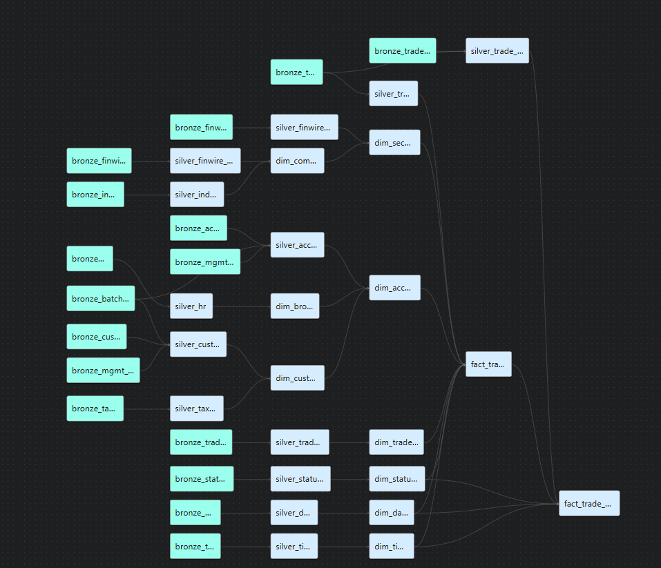

# 5. Gold Layer — Star Schema

**Scope:** the Kimball dimensional model built on top of `04_silver.md`.
Gold's job is narrower than silver's — silver already answered "what
does it mean"; gold answers **how does it fit into a star schema a BI
tool can query directly**: surrogate keys, conformed dimensions, fact
grain, denormalized outriggers.

## Table of contents
- [5. Gold Layer — Star Schema](#5-gold-layer--star-schema)
  - [Table of contents](#table-of-contents)
  - [5.1 Governing Principle](#51-governing-principle)
  - [5.2 Tables Intentionally Not Modeled](#52-tables-intentionally-not-modeled)
  - [5.3 Source Mapping Table](#53-source-mapping-table)
  - [5.4 Architecture Decision Records](#54-architecture-decision-records)
    - [ADR-001: Outrigger dimensions instead of centipede fact tables or full snowflaking](#adr-001-outrigger-dimensions-instead-of-centipede-fact-tables-or-full-snowflaking)
    - [ADR-002: Denormalize Industry into `dim_company`](#adr-002-denormalize-industry-into-dim_company)
    - [ADR-003: Denormalize Tax Rate into `dim_customer`](#adr-003-denormalize-tax-rate-into-dim_customer)
    - [ADR-004: `dim_prospect.customer_sk` is nullable](#adr-004-dim_prospectcustomer_sk-is-nullable)
    - [ADR-005: Derived FKs on `fact_holding` instead of a fact-to-fact join](#adr-005-derived-fks-on-fact_holding-instead-of-a-fact-to-fact-join)
    - [ADR-006: `originating_trade_id`/`current_trade_id` kept as degenerate dimensions](#adr-006-originating_trade_idcurrent_trade_id-kept-as-degenerate-dimensions)
    - [ADR-007: Universal surrogate keys, with two deliberate exceptions](#adr-007-universal-surrogate-keys-with-two-deliberate-exceptions)
    - [ADR-009: Trade fact split — `fact_trade` (latest state) + `fact_trade_history` (status lineage)](#adr-009-trade-fact-split--fact_trade-latest-state--fact_trade_history-status-lineage)
  - 
  - [Open questions](#open-questions)

---

## 5.1 Governing Principle

Every column on a gold table must trace to a silver column — either
directly (same value, possibly renamed for a friendlier gold-facing
name), or via a documented resolution join to a different silver model
(a denormalized outrigger lookup, or a derived FK). Gold does not
introduce a column silver doesn't already have, and does not carry a
column into gold that silver doesn't actually output, without an
explicit decision recorded in this document — same discipline
`02_bronze_design.md` §2.1 and `04_silver.md` §4.1 each apply to their
own layer boundary.

All models carry a surrogate key (`_sk`), with the two exceptions
recorded in ADR-007.

---

## 5.2 Tables Intentionally Not Modeled

| Source file | Reason |
|---|---|
| `BatchDate.txt` | Control file (single as-of date per batch) — used by ETL orchestration, not part of the analytical model. |
| `*_audit.csv` | ETL/operational audit metrics (row counts, etc.) — used for pipeline monitoring, not part of the analytical model. |

Both are defined and consumed upstream — see `01_sources.md` §1.3 and
`03_ingestion.md` §3.5.

---

## 5.3 Source Mapping Table

| Gold table | Silver source(s) | Resolution needed beyond a direct column map |
|---|---|---|
| `dim_date` | `silver_date` | None — direct pass-through, renamed. |
| `dim_time` | `silver_time` | None — direct pass-through, renamed. |
| `dim_statustype` | `silver_status_type` | None. |
| `dim_tradetype` | `silver_trade_type` | None. |
| `dim_broker` | `silver_hr` | None. |
| `dim_company` | `silver_finwire_company` | `industry_name`/`sector_id` resolved via join to `silver_industry` on `industry_id` (ADR-002). |
| `dim_security` | `silver_finwire_security` | `company_sk` resolved via join to `dim_company` on `company_name`/`company_cik` (whichever is populated). |
| `dim_customer` | `silver_customer` | Tax rate columns resolved via join to `silver_tax_rate` on `local_tax_rate_id`/`national_tax_rate_id` (ADR-003). |
| `dim_account` | `silver_account` | None beyond `broker_sk`/`customer_sk` FK resolution (standard dimension lookups). |
| `dim_prospect` | `silver_prospect` | `customer_sk` resolved via the (unconfirmed) Prospect-to-Customer matching rule — [Open questions](#open-questions). |
| `fact_trade` | `silver_trade` | None beyond standard dimension FK resolution (`security_sk`, `account_sk`, `status_type_sk`, `trade_type_sk`, `trade_date_sk`/`trade_time_sk` split from `trade_timestamp`). |
| `fact_trade_history` | `silver_trade_history` | `account_sk`/`security_sk` resolved via lookup to `fact_trade` on `trade_sk` (ADR-010) — not present in `silver_trade_history` itself. |
| `fact_holding` | `silver_holding_history` | `account_sk`/`security_sk`/`holding_date_sk` resolved via lookup to `fact_trade` on `trade_id` (ADR-006). |
| `fact_cashtransaction` | `silver_cash_transaction` | None beyond standard FK resolution. |
| `fact_watchitem` | `silver_watch_history` | None beyond standard FK resolution. |
| `fact_market_history` | `silver_daily_market` | None beyond standard FK resolution. |
| `fact_company_financials` | `silver_finwire_financials` | `company_sk` resolved via join to `dim_company` on `company_name`/`company_cik`. |

---

## 5.4 Architecture Decision Records

### ADR-001: Outrigger dimensions instead of centipede fact tables or full snowflaking

**Context:** `dim_company` (reached via `dim_security`) and
`dim_prospect` (reached via `dim_customer`) have no independent grain
relationship to any fact table.

**Decision:** model them as **outriggers** — a single controlled hop
off their parent dimension, not a direct fact-table FK.

**Alternatives considered:**
- **Centipede fact table** (adding `company_sk` and `prospect_sk`
  directly to every relevant fact): rejected — creates two parallel
  join paths into the same data (fact → security → company, *and*
  fact → company directly), risking fan-out/double-counting and adding
  FK columns to fact tables for what's really an attribute of an
  existing dimension, not the transaction itself.
- **Full snowflaking** (company → industry → sector as a normalized
  chain): rejected — over-normalizes low-cardinality data, adds join
  hops with no analytical benefit.
- **Flattening company attributes into `dim_security`**: viable,
  rejected only to keep company reusable (one company can issue
  multiple securities) rather than duplicating attributes per security
  row.

**Consequence:** one join hop required to reach company or prospect
attributes from a fact table — a standard, low-cost Kimball pattern,
not the same failure mode as snowflaking a dimension's own native
attributes.

### ADR-002: Denormalize Industry into `dim_company`

**Context:** `silver_finwire_company` carries `industry_id` only — not
the industry name or sector. Industry/sector (`silver_industry`) is
low-cardinality reference data with no independent grain relevant to
any fact table.

**Decision:** resolve `industry_id` → `industry_name`/`sector_id` via
join to `silver_industry` at ETL time, store flattened directly on
`dim_company` (`industry_code`, `industry_name`, `sector_id`) rather
than modeling a separate `dim_industry` outrigger.

**Reason:** same reasoning as ADR-001 — a standalone `dim_industry`
would add a join hop with no analytical benefit for data this
low-cardinality and this tightly bound to company.

### ADR-003: Denormalize Tax Rate into `dim_customer`

**Context:** `silver_customer` carries `local_tax_rate_id`/
`national_tax_rate_id` as raw codes, not resolved rate details.

**Decision:** resolve both codes to name/percentage via join to
`silver_tax_rate` at ETL time, store flattened directly on
`dim_customer` (`local_tax_rate_code/name/pct`,
`national_tax_rate_code/name/pct`) rather than a separate
`dim_taxrate` outrigger.

**Reason:** same reasoning as ADR-002.

### ADR-004: `dim_prospect.customer_sk` is nullable

**Decision:** `dim_prospect.customer_sk` is `NULL`-able, not `NOT NULL`.

**Reason:** a prospect is a marketing target that may or may not ever
convert to a customer — most never do. A `NOT NULL` constraint would
make it impossible to load any non-converted prospect, the majority of
the table. Also depends on the Prospect-to-Customer matching rule,
still unresolved ([Open questions](#open-questions)) — the column
can't be populated at all until that rule is confirmed.

### ADR-005: Derived FKs on `fact_holding` instead of a fact-to-fact join

**Context:** `HoldingHistory.txt` (via `silver_holding_history`)
carries only `originating_trade_id`, `trade_id`, before/after quantity
— no account, security, or date columns (`01_sources.md` §1.2.9).

**Decision:** resolve `account_sk`, `security_sk`, `holding_date_sk`
during ETL by looking up the associated trade in `fact_trade` (via
`trade_id`), and store the resolved surrogate keys directly on
`fact_holding`.

**Alternatives considered:**
- **Live fact-to-fact join at query time**: rejected — Kimball
  generally avoids direct fact-to-fact joins; complicates BI semantic
  layers and risks incorrect fan-out if the relationship cardinality
  isn't perfectly 1:1 (it isn't — see ADR-006).
- **Leave `fact_holding` joined only by degenerate dimensions, no
  account/security FK at all**: rejected — would force every "holdings
  by account/security" query through a manual trade lookup, defeating
  the purpose of a dimensional model.

**Consequence:** `fact_holding` must load after `fact_trade` within the
same batch (ETL ordering dependency), since the lookup depends on the
trade already being present.

### ADR-006: `originating_trade_id`/`current_trade_id` kept as degenerate dimensions

**Context:** initial design assumed `fact_trade` ↔ `fact_holding` was
1:1 via `originating_trade_id`.

**Decision:** both `originating_trade_id` and `current_trade_id` are
stored as plain degenerate-dimension columns (informational, not
enforced FKs with a declared cardinality).

**Alternatives considered:**
- **Enforce 1:1 via `originating_trade_id`**: rejected — a single
  originating trade can be referenced by many subsequent holding rows
  as a position is modified over time (1:M in practice).
- **Enforce 1:1 via `current_trade_id`**: also rejected — a single sell
  trade can close out multiple original lots at once (lot-splitting),
  producing more than one holding row per triggering trade.

**Consequence:** no declared cardinality between the two facts —
documented as "informational lineage, not a guaranteed 1:1 join" so no
downstream query assumes uniqueness the data doesn't guarantee.

### ADR-007: Universal surrogate keys, with two deliberate exceptions

**Decision:** all gold tables use a generated `bigserial` surrogate
key, **except**:
- `dim_date.date_sk` / `dim_time.time_sk`: use the source's own
  meaningful integer key (`sk_dateid`/`sk_timeid`, via
  `silver_date`/`silver_time`) — a standard Kimball "smart date/time
  key" pattern.
- `fact_trade.trade_sk`: uses `trade_id` directly, not a generated
  value.

**Reason:**
- Smart date/time keys give real, standard benefits a random surrogate
  would lose: human-readable ad-hoc filtering (e.g. `WHERE date_sk
  BETWEEN 20260101 AND 20260131`) and straightforward partitioning.
- `trade_id` was confirmed (real query) globally unique across all
  batches. Generating a separate surrogate on top of an
  already-unique natural key would be pure indirection — an extra
  lookup step every downstream join has to perform for no analytical
  gain.

**Consequence:** `fact_trade_history.trade_sk` is a real FK to
`fact_trade.trade_sk` (ADR-010) — this works cleanly precisely because
`fact_trade.trade_sk` is guaranteed unique, unlike the `fact_holding`
case in ADR-005/006.

### ADR-009: Trade fact split — `fact_trade` (latest state) + `fact_trade_history` (status lineage)

**Context:** the same problem `04_silver.md` ADR-002 (Trade) documents
— a single event-grain fact table would force every economic-measure
aggregate (`SUM(commission)`, etc.) to filter to a current version, or
silently multiply those measures by however many status transitions a
trade went through — a classic Kimball fan trap.

**Decision:** gold mirrors the `silver_trade`/`silver_trade_history`
split exactly:
- `fact_trade`: one row per `trade_id`, latest known economic state.
  Sourced directly from `silver_trade`.
- `fact_trade_history`: one row per `(trade_id, status_date_sk,
  status_time_sk, status_type_sk)`, full status-transition lineage.
  Sourced directly from `silver_trade_history`. Linked to `fact_trade`
  via a real FK on `trade_sk` — safe here, unlike `fact_holding` ↔
  `fact_trade` (ADR-005/006), because this is a true
  1-parent/many-children relationship: every history row belongs to
  exactly one trade, and `fact_trade.trade_sk` is guaranteed unique
  (ADR-007).
- `account_sk`/`security_sk` are additionally resolved directly onto
  `fact_trade_history` (not left as a required join to `fact_trade`) —
  the same derived-FK pattern as ADR-005, extended here since the
  storage cost is negligible against the query convenience of not
  forcing a join for every "trade status history by account/security"
  query.
- `source_model` is carried onto `fact_trade_history` for lineage,
  mirroring `silver_trade_history`'s `_source_model`
  (`04_silver.md` ADR-002) — which of the two unified bronze sources
  (`bronze_trade_history` vs. `bronze_trade`) produced a given row.

**Reason:** full reasoning in `04_silver.md` ADR-002 — gold simply
carries the same grain decision forward into the star schema.

---

## Open questions

1. **Official Prospect-to-Customer matching rule** (TPC-DI spec
   Clause 4.5.x) not yet confirmed. Blocks populating
   `dim_prospect.customer_sk` (ADR-004).