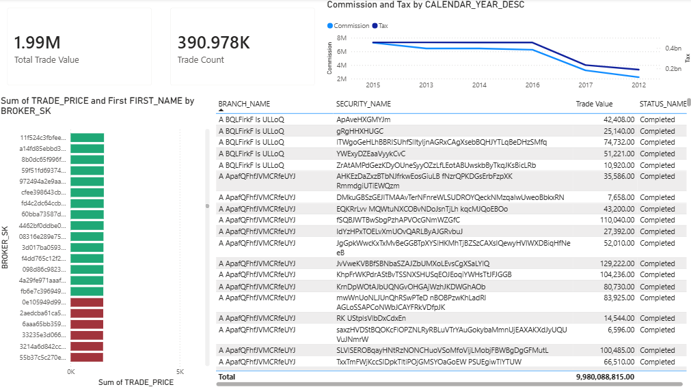

# 14. Downstream & BI/Self-Service Enabling

Making the gold layer safely and reliably consumable by non-technical/downstream teams, without engineering in the loop for every question.

**Simple Power BI dashboard:**


## What "enabling" means here

Not just "connect Power BI." It means the platform itself is BI-ready:

- Consistent, documented, contract-enforced schemas
- PII/sensitivity classification visible to consumers
- A clean join graph (no ambiguous paths) so any tool can build a semantic model on top
- Scoped, least-privilege access for self-service roles
- Cost isolation so BI query load doesn't compete with ELT

## 1. Gold layer contracts

All gold models ship with `contract: enforced: true` in `dbt` (see `models/gold/schema.yml`). This is the foundation of self-service: downstream tools trust column names/types won't silently change.

- Every dimension has a stable surrogate key (`_sk`), tested `unique` + `not_null`
- `meta.classification` (`public` / `internal` / `confidential` / `restricted_pii`) and `meta.pii` flags are set per column — this is what lets a BI admin decide what's exposable to which role, without re-auditing the schema by hand
- SCD2 dims (`dim_account`, `dim_customer`) carry `is_current` / `effective_start_date` / `effective_end_date` so downstream users can self-serve point-in-time vs. current-state without needing engineering to build separate views

## 2. Join graph discipline

Self-service breaks the moment two tables have more than one valid path between them — the BI tool (or the user) picks the wrong one silently. We manage this centrally, not per-report:

- Relationships defined once via **Tabular Editor** script (`power_bi/tabular.c#`), not clicked together ad hoc in Power BI Desktop — script is reviewable, diffable, reproducible across dev/prod
- Ambiguous paths resolved by deactivating the non-primary relationship (e.g. `fact_company_financials.posting_date_sk → dim_date` is inactive; `fiscal_date_sk` is the active, business-correct grain). Documented in the script comments so downstream doesn't need to guess
- Fact-to-fact relationships (`fact_holding → fact_trade`, `fact_trade_history → fact_trade`) are inactive by default to prevent double-counting through two live filter paths

Net effect: a self-service user drags fields onto a visual and gets a correct answer by default, without understanding the underlying grain.

## 3. Access model

- `role_analyst` (see `sql/roles.sql`) — `SELECT` only, gold-layer schemas only. No visibility into silver/bronze, no write grants
- This is the role Power BI DirectQuery connects as — self-service users inherit exactly this scope, nothing more
- `restricted_pii` columns (names, addresses, tax IDs, phone numbers) stay queryable by role but should be masked/excluded at the semantic-model level for broad self-service audiences; only grant column-level access to roles that need it

## 4. Query isolation (DirectQuery)

```sql
CREATE WAREHOUSE IF NOT EXISTS bi_wh
  WAREHOUSE_SIZE = 'XSMALL'
  AUTO_SUSPEND = 60
  AUTO_RESUME = TRUE;
```

- Dedicated warehouse for BI traffic, separate from ELT/transform warehouses — self-service query patterns (frequent, small, unpredictable) shouldn't compete with or block scheduled pipeline jobs
- `AUTO_SUSPEND = 60` keeps idle cost near zero between report opens — self-service is spiky, not constant
- DirectQuery (not Import) chosen deliberately: report stays live against gold-layer contracts, no separate refresh schedule to own, no duplicate copy of PII data sitting in a `.pbix` file
